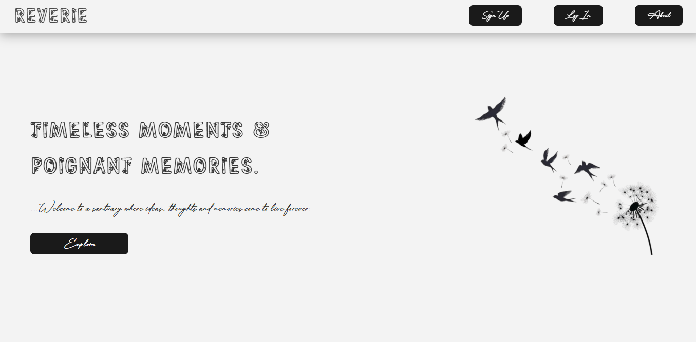
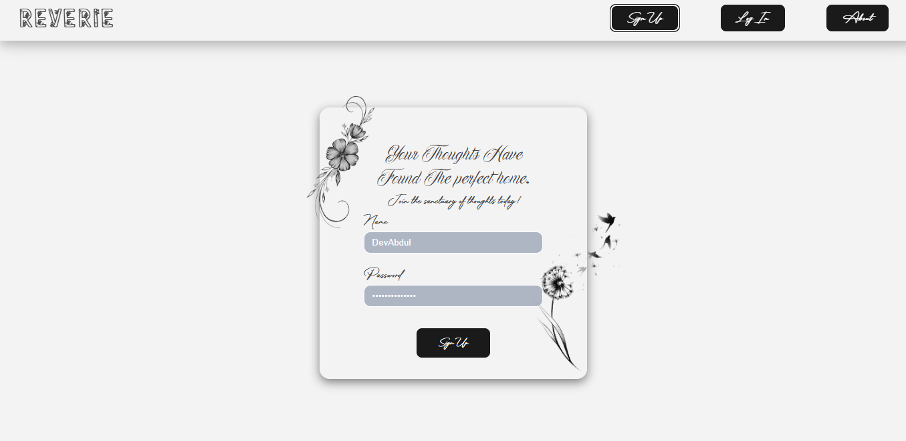
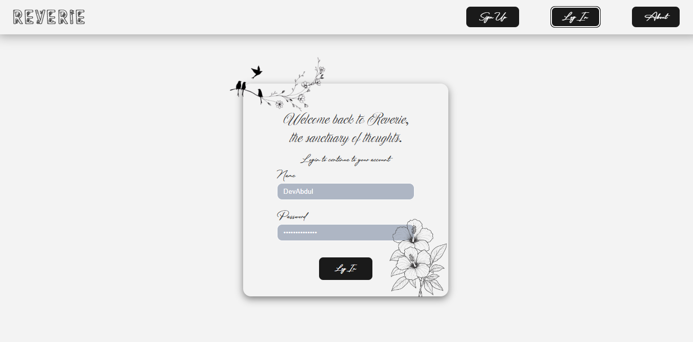
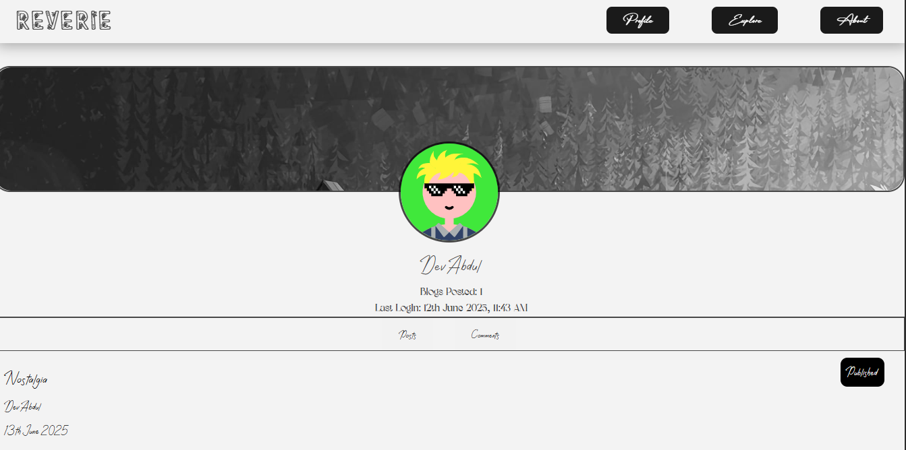
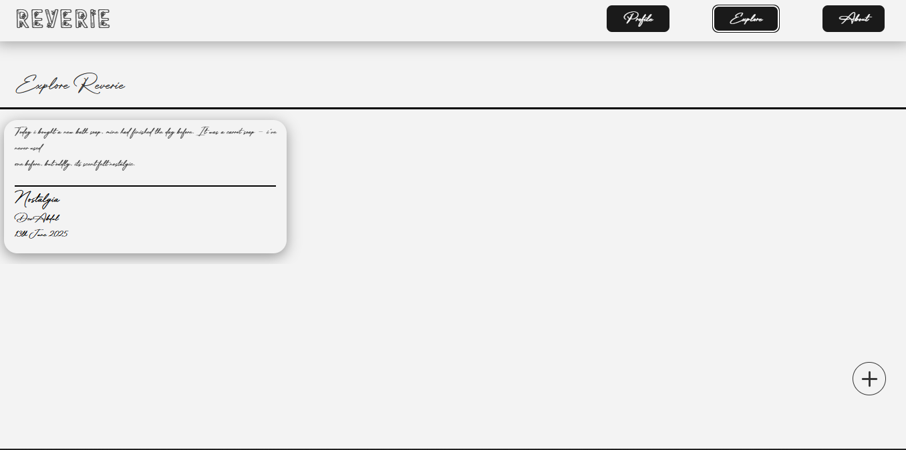
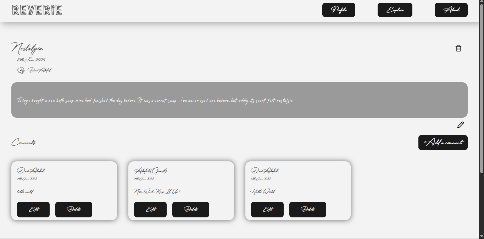

# Reverie

My Submission for The Odin Project's Blog API Project.

## Details

This project is part of the Odin Project's Curriculum. It is meant for learners to practice what they've learnt in the API Basics Module (Under the NodeJS course) by building a jamstack based Blog app that decouples the frontend and backend into seperate parts, with the backend being an Express API which uses JWT to protect sensitive routes. This project is the frontend which is built using react and uses react-router for routing. The project's backend reliant features like fetching, creating, editing, publishing and deleting a blog post are provided by the ReverieEngine API, which is fully decoupled from the frontend and hosted on a different platform. 

## Features
   Features of Reverie include:

   * Sleek Minimalist UI - I've taken the time to build a sleek, minimalisic UI for Reverie that feels easy on the eyes while at the same time being aesthetically pleasing.

   * User Account - Reverie has a sign up page that allows users to create accounts, login and access privileges such as editing, publishing and deleting blog posts and comments. 

   * Smooth Page Transitions: Reverie implements a smooth and efficient page transition animation across all pages.

   * Post CRUD: Reveries implements all CRUD functionality for blog posts on the platform.

   * Comment CRUD: Reveries implements all CRUD functionality for comments on the platform.

## Showcase

   More Images of Reverie:

   * Home Page:

   

   * Sign Up Page:

   

   * Login Page:

   

   * Profile Page:

   

   * Explore Page:

   

   * Post Page:

   

   ## Vist

   Kindly use the link below to visit Reverie:

   
 
  
   